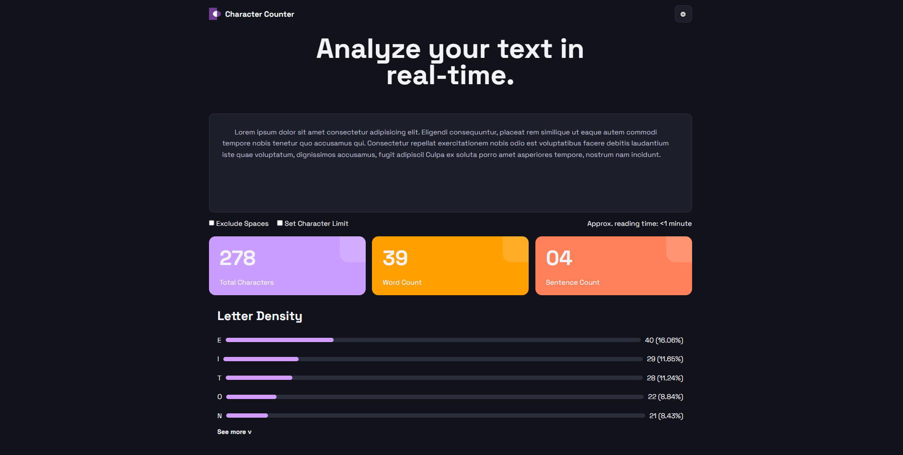
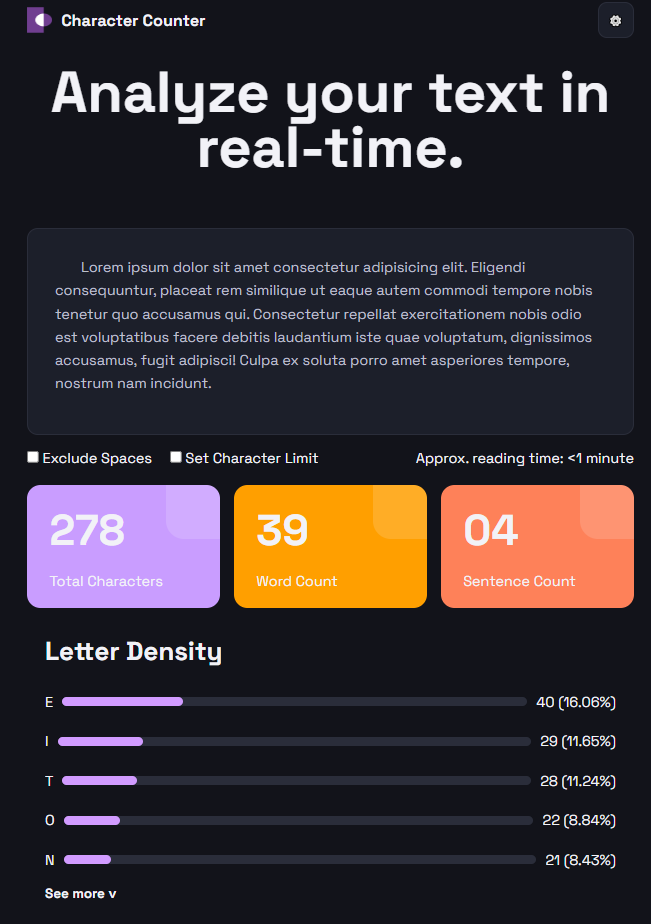

# Character Counter

## - Objetivo del proyecto

El objetivo de este proyecto fue recrear una página de análisis de texto usando HTML y CSS. La idea era practicar maquetación, Flexbox, variables CSS y diseño responsive a partir de un diseño de referencia.

## - Tecnologías utilizadas

* HTML5
* CSS3
* Google Fonts (Space Grotesk)
* Git y GitHub

## - Cómo organicé el HTML

Primero hice un header con el logo y el botón de configuración. Después dividí la página en distintas secciones:

* Hero (título y textarea)
* Controls (checkboxes y tiempo de lectura)
* Stats (las tres cards)
* Letter Density (las barras y el botón See more)

De esta forma el código quedó más ordenado y fácil de modificar.

## - Cómo resolví el CSS

Utilicé variables CSS para los colores, Flexbox para acomodar los elementos y Media Queries para que la página se adapte a pantallas más chicas. También usé bordes redondeados, espaciados y distintos estilos para que el resultado se pareciera al diseño original.

## - Dificultades encontradas

Lo que más me costó fue acomodar algunos elementos para que quedaran parecidos al diseño de referencia, especialmente las cards, las barras de Letter Density y la alineación del logo con el botón de configuración. También tuve que ajustar tamaños, espacios y detalles visuales hasta llegar a un resultado parecido al original.

## - Objetivo del proyecto

## Conclusión

Este proyecto me permitió practicar HTML, CSS, Flexbox, variables CSS, Media Queries y el uso de Git y GitHub para el control de versiones.
